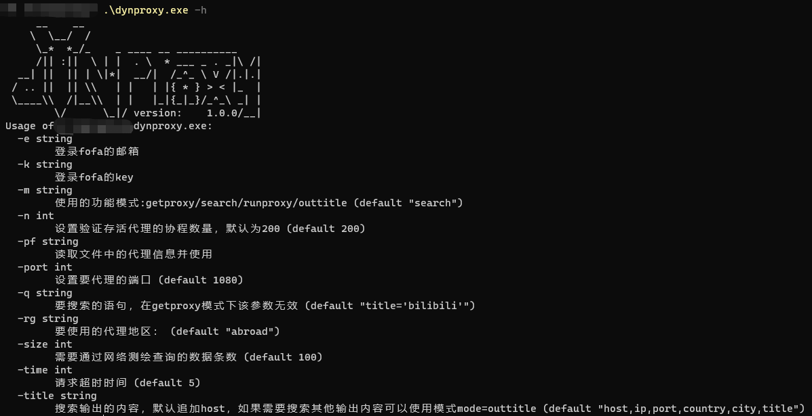
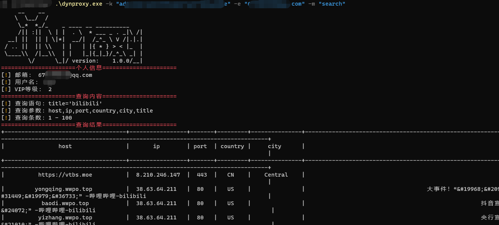
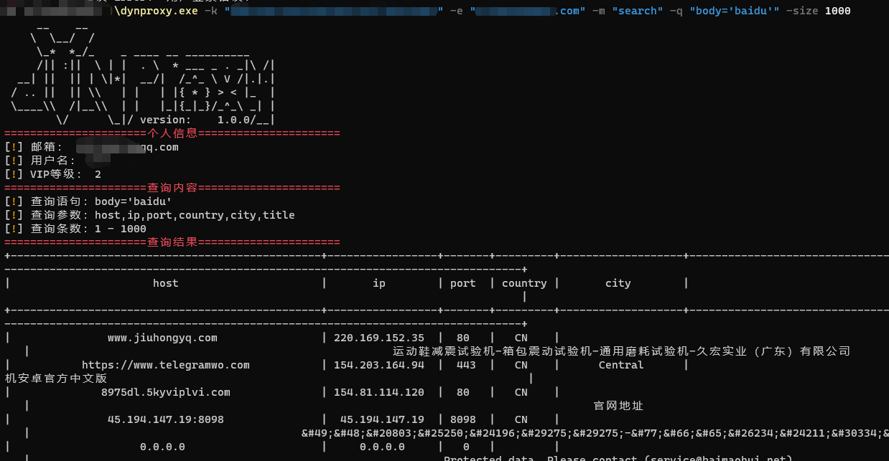

# 壹 简介

名字：`Dynproxy`

作用：该工具主要是用于获取免费的动态代理或者网络空间资产测绘

# 贰 原理

通过网络空间资产测绘获取免费的动态代理

# 叁 使用

- 编译

```bash
go build -ldflags="-s -w" -trimpath  .
```

- 帮助`-h`



- 模式：search（资产测绘搜索，默认是该模式），该模式需要设置测绘key信息






- 模式：getproxy（通过资产测绘搜索获取代理并使用），该模式需要设置测绘key信息


- 模式：runproxy（通过文件获取现有代理设置并使用），该模式不需要设置测绘key信息，但需要通过`pf`参数设置文件路径


# 肆 常用

```bash
# 资产测绘搜索
dynproxy -k "fofa_key" -e "邮箱" -m "search" -q "body='baidu'"
# 资产测绘搜索，设置查询条数
dynproxy -k "fofa_key" -e "邮箱" -m "search" -q "body='baidu'" -size 1000
# 通过资产测绘搜索获取代理并使用
dynproxy -k "fofa_key" -e "邮箱" -m "getproxy"
# 通过文件获取现有代理设置并使用
dynproxy -m "runproxy" -pf .\dynproxyabroads.txt
```
